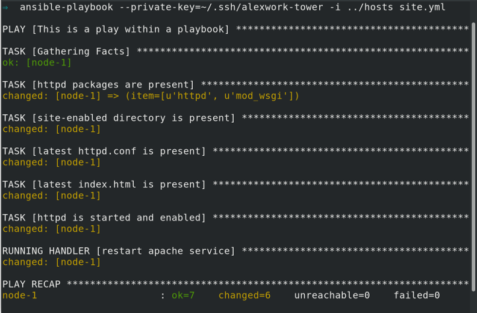

# Exercise 4 - apache-basic-playbookを実行する

おめでとうございます!  
ここまでで、全てではないにしてもAnsibleの主要なコンセプトのほとんどを含んだPlaybookを書き終えることができました。まずは実際に実行できるかを確認してみましょう。


## Section 1 - apache-basic-playbookを実行する

### Step 1:
適切なディレクトリに居ることを確認します。

```bash
cd ~/apache-basic-playbook
```

---
**NOTE**


inventoryファイルはExercise 1で指定したものと同じものを利用します。
今回の演習では、ansible.cfgファイルで定義されているため、省略が可能です。
---

### Step 2:
playbookを実行します。

```bash
ansible-playbook site.yml
```

## Section 2: この演習の最後に
問題なく実行された場合、以下のような内容が標準出力として表示されます。
エラーが表示される場合は、問題箇所を特定するのでお知らせください。
```
[student1@ansible apache-basic-playbook]$ ansible-playbook site.xml

PLAY [This is a play within a playbook] ***************************************************************************************************************************

TASK [Gathering Facts] ********************************************************************************************************************************************
ok: [node3]
ok: [node2]
ok: [node1]

TASK [httpd packages are present] *********************************************************************************************************************************
changed: [node3] => (item=[u'httpd', u'mod_wsgi'])
changed: [node2] => (item=[u'httpd', u'mod_wsgi'])
changed: [node1] => (item=[u'httpd', u'mod_wsgi'])

TASK [site-enabled directory is present] **************************************************************************************************************************
changed: [node1]
changed: [node2]
changed: [node3]

TASK [latest httpd.conf is present] *******************************************************************************************************************************
changed: [node2]
changed: [node3]
changed: [node1]

TASK [latest index.html is present] *******************************************************************************************************************************
changed: [node1]
changed: [node2]
changed: [node3]

TASK [httpd is started and enabled] *******************************************************************************************************************************
changed: [node2]
changed: [node1]
changed: [node3]

RUNNING HANDLER [restart apache service] **************************************************************************************************************************
changed: [node3]
changed: [node2]
changed: [node1]

PLAY RECAP ********************************************************************************************************************************************************
node1                      : ok=7    changed=6    unreachable=0    failed=0   
node2                      : ok=7    changed=6    unreachable=0    failed=0   
node3                      : ok=7    changed=6    unreachable=0    failed=0   
```
<!--

-->

---

[Ansible Linklightのページへ戻ります - Ansible Engine Workshop](../README.ja.md)


[次のExerciseへ](../5-role/README.ja.md)
