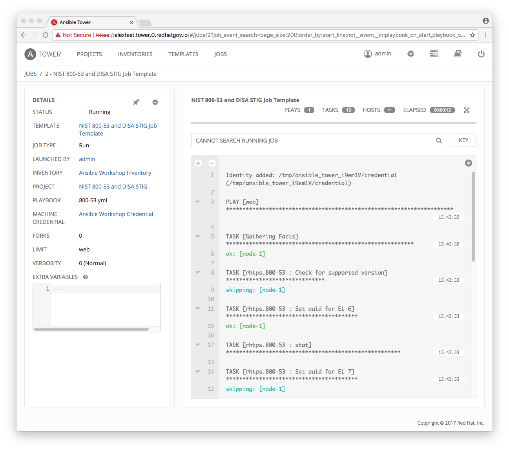
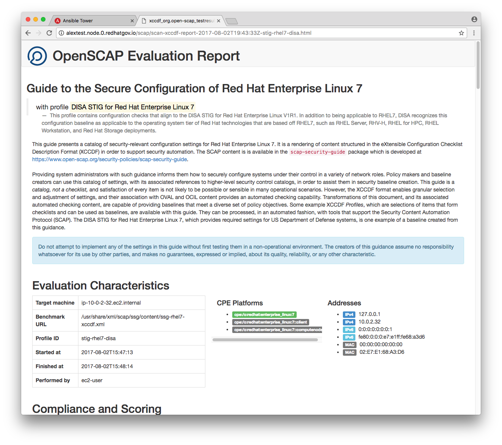

# 演習 4 - Ansible Towerを用いたセキュリティの実装

この演習ではAnsible Towerを利用し、保有しているシステム環境がセキュリティ基準(DISA STIGとNIST 800-53)への対応のコンフィグレーションおよび、実行後の評価・確認を実行します。
なお、NIST 800-53のRoleにはDISA STIGのターゲットホストに対する実行・評価も含まれています。

DISA STIG:国防情報システム局 セキュリティ技術導入ガイド

NIST 800-53:連邦政府情報システムおよび連邦組織のためのセキュリティ管理策とプライバシー管理策

* [DISA STIG controls](https://galaxy.ansible.com/MindPointGroup/RHEL7-STIG/)
* [NIST 800-53 controls](https://galaxy.ansible.com/rhtps/800-53/)

## DISA STIGとNIST 800-53のRoleをTowerノードへ追加します

### Step 1:

以下のコマンドを用いて、NIST 800-53のAnsibleロールをAnsibleTowerノードへインストールします。
In your wetty window (if you closed it, see the [SETUP](../setup.md) step, in your workbook), type the following:

```bash
sudo ansible-galaxy install rhtps.800-53
```

### Step 2:

Towerノードへインストールが完了したら、それを使用するためのPlaybookを作成します。
まず、Playbookを配置するためのディレクトリを作成し、Towerから直接参照できるようにします。その後、Playbookを作成します。

```bash
sudo mkdir -p /var/lib/awx/projects/playbooks
```

### Step 3:

必要なPlaybookを作成しましょう。
これまでの演習でPlaybookについては理解しているはずですので、この演習内では詳細な説明を省略します。
もし不明なことがあれば、インストラクターへ質問してください。

```bash
sudo vim /var/lib/awx/projects/playbooks/800-53.yml
```

[register](http://docs.ansible.com/ansible/latest/playbooks_conditionals.html#register-variables), [with_items](http://docs.ansible.com/ansible/latest/playbooks_loops.html#standard-loops),  [when](http://docs.ansible.com/ansible/latest/playbooks_conditionals.html#the-when-statement) の使用方法に注意してください。

上記へはAnsible Playbookの実装においてそれぞれどのように変数を作成し、再帰的に利用し、条件を定義しているかといった方法が記載されています。

```yml

---
- hosts: web
  become: yes
  vars:
    scap_reports_dir: /tmp
    scap_profile: stig-rhel7-disa
  roles:
    - rhtps.800-53

  tasks:
    - name: determine the most recent scap report
      command: ls -tr /tmp/scap_reports/
      register: results

    - name: create the scap directory in the web server content
      file:
        name: /var/www/html/scap
        state: directory
        mode: 0755

    - name: copy SCAP reports to the web server content directory
      copy:
        remote_src: True
        src: "/tmp/scap_reports/{{ item }}"
        dest: /var/www/html/scap
        mode: 0644
      with_items: "{{ results.stdout_lines }}"
      when: item | match("scan-xccdf-report-*")

```

### Step 4:

Playbookの作成が完了したら保存してエディタを閉じてください。
この後のステップでTower内の設定を実行します。

## Ansible TowerでセキュリティのプロジェクトとJob Templateを作成します

### Step 1:

TowerのGUIにて、プロジェクトをクリックします。 

### Step 2:

ADDをクリックします。 

### Step 3:

以下の値を用いて新しプロジェクトをコンフィグします。
注意：SCMタイプをマニュアルへ設定した時点で、`PLAYBOOK DIRECTORY`(`プロジェクトのベースパス`)と`プレイブックディレクトリー`へplaybooksが表示されるはずです。

NAME(名前) |NIST 800-53 and DISA STIG
-----|-------------------------
DESCRIPTION(説明)|Security Project
ORGANIZATION(組織)|Default
SCM TYPE(SCMタイプ)|Manual(手動)
PROJECT BASE PATH(プロジェクトのベースパス)|/var/lib/awx/projects
PLAYBOOK DIRECTORY(PLAYBOOKディレクトリー)|playbooks

### Step 4:

SAVEをクリックしてください。 

### Step 5:

TowerのGUIで,`TEMPLATES`(テンプレート)を選択してください。

### Step 6:

ADD(追加)をクリックし、 ,  `JOB TEMPLATE`を選択してください。

### Step 7:

以下の値でJob Templateを作成します。
注意：`PLAYBOOK`のフィールドは、`800-53.yml`のみが表示されるはずです。
  Note that the `PLAYBOOK` field should offer `800-53.yml` as an option, when clicked.

NAME(名前) |NIST 800-53 and DISA STIG Job Template
-----|--------------------------------------
DESCRIPTION(説明)|Template for security playbooks
JOB TYPE(ジョブタイプ)|Run
INVENTORY(インベントリー)|Ansible Workshop Inventory
PROJECT(プロジェクト)|NIST 800-53 and DISA STIG
PLAYBOOK|800-53.yml
MACHINE CREDENTIAL(認証情報)|Ansible Workshop Credential
LIMIT(制限)|web
OPTIONS(オプション)
- [x] Enable Privilege Escalation(権限昇格の有効化)

### Step 8:

SAVE(保存)をクリック し、新しいJob Templateを保存します。
ここまでで、ジョブを実行する準備は環境です。

保存が完了したら、画面を最下部へスクロールするか再度`テンプレート`をクリックし、先ほど作成した`NIST 800-53 Job Template`のエントリー横へ表示されているロケットアイコン  をクリックし、ジョブを実行します。

実行すると、以下の画面のような実行状況を確認することができるはずです。
全てのJobが完了するまで5~10分ほどかかります。
全てのJobが完了すれば、Playbookの中で生成されWebサーバへUploadされたSCAPのレポートへアクセスできるようになります。





### End Result

演習を通じて、管理対象のノードに対して実行されたスキャンを確認することができました。
各コンプライアンスチェックのタスクには名前が付けられ、詳細が記されていました。

チェックが完了したのち、ウェブブラウザを用いて以下のURLへアクセスすることでレポートを確認できます。
```bash
http://workshopname.node.#.redhatgov.io/scap
```
`workshopname` は本日参加しているワークショップ名です。
`#` は、インストラクターから各参加者へ与えられている番号です。

`scan-xccdf-report-...` と表示されているリンクをクリックし、SCAPレポートが生成されていることを確認してください。
必要に応じ、レポートの生成が失敗していないか、レポートで出力されている内容とTowerのジョブ実行結果を比較や、実機へのSSHログインなどで確認をしてみてください。

---

[Ansible Lightbulbのページへ戻ります - Ansible Tower Workshop](../README.ja.md)
